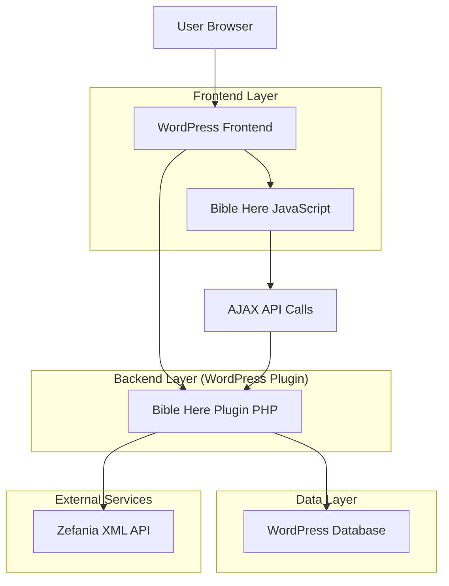
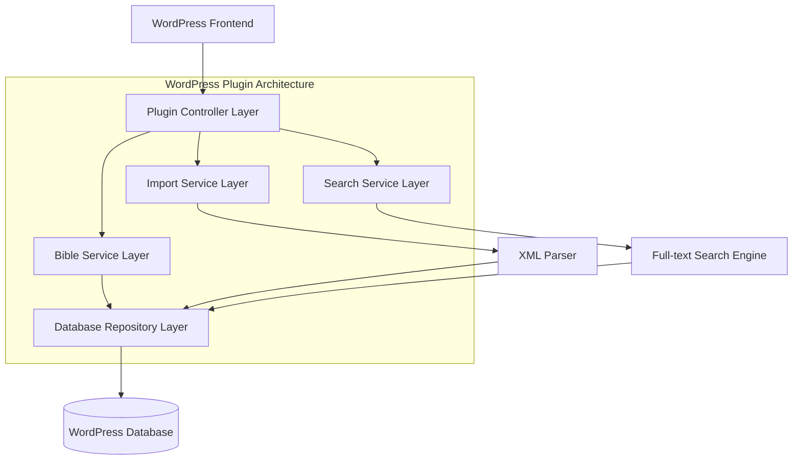
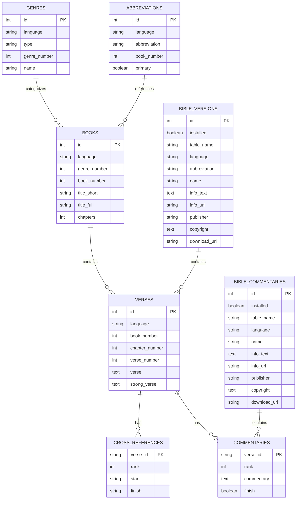

# Bible Here WordPress Plugin 技術架構文檔

## 1. Architecture design



## 2. Technology Description

* Frontend: JavaScript (ES6+) + WordPress前端API + 響應式CSS

* Backend: PHP 7.4+ + WordPress Plugin API + WordPress Database API

* Database: MySQL 5.7.6+ / MariaDB 10.0.15+ (支持utf8mb4和全文搜索)

* External: Zefania XML格式聖經數據導入

## 3. Route definitions

| Route                                        | Purpose           |
| -------------------------------------------- | ----------------- |
| /bible-reader                                | 聖經閱讀主頁面，顯示聖經內容和導航 |
| /bible-search                                | 聖經搜索頁面，提供全文搜索功能   |
| /wp-admin/admin.php?page=bible-here          | 管理後台主頁面，聖經版本管理    |
| /wp-admin/admin.php?page=bible-here-import   | 聖經導入頁面，遠程下載和安裝聖經  |
| /wp-admin/admin.php?page=bible-here-settings | 插件設定頁面，配置功能選項     |

## 4. API definitions

### 4.1 Core API

聖經內容獲取API

```
POST /wp-admin/admin-ajax.php
Action: bible_here_get_verses
```

Request:

| Param Name   | Param Type | isRequired | Description             |
| ------------ | ---------- | ---------- | ----------------------- |
| version      | string     | true       | 聖經版本縮寫 (如 "kjv", "cnv") |
| book         | integer    | true       | 書卷編號 (1-66)             |
| chapter      | integer    | true       | 章節編號                    |
| start\_verse | integer    | false      | 起始節數，默認為1               |
| end\_verse   | integer    | false      | 結束節數，默認為該章最後一節          |

Response:

| Param Name      | Param Type | Description |
| --------------- | ---------- | ----------- |
| success         | boolean    | API調用是否成功   |
| data            | array      | 經文數據數組      |
| data.verses     | array      | 經文列表        |
| data.book\_info | object     | 書卷信息        |

Example:

```json
{
  "version": "kjv",
  "book": 1,
  "chapter": 1,
  "start_verse": 1,
  "end_verse": 2
}
```

聖經搜索API

```
POST /wp-admin/admin-ajax.php
Action: bible_here_search
```

Request:

| Param Name | Param Type | isRequired | Description |
| ---------- | ---------- | ---------- | ----------- |
| query      | string     | true       | 搜索關鍵字       |
| version    | string     | true       | 搜索的聖經版本     |
| limit      | integer    | false      | 結果數量限制，默認20 |
| offset     | integer    | false      | 分頁偏移量，默認0   |

Response:

| Param Name   | Param Type | Description |
| ------------ | ---------- | ----------- |
| success      | boolean    | 搜索是否成功      |
| data         | object     | 搜索結果數據      |
| data.results | array      | 搜索結果列表      |
| data.total   | integer    | 總結果數量       |

聖經版本導入API

```
POST /wp-admin/admin-ajax.php
Action: bible_here_import_version
```

Request:

| Param Name    | Param Type | isRequired | Description        |
| ------------- | ---------- | ---------- | ------------------ |
| download\_url | string     | true       | Zefania XML文件下載URL |
| version\_info | object     | true       | 版本信息對象             |

Response:

| Param Name | Param Type | Description |
| ---------- | ---------- | ----------- |
| success    | boolean    | 導入是否成功      |
| message    | string     | 操作結果消息      |
| progress   | integer    | 導入進度百分比     |

## 5. Server architecture diagram



## 6. Data model

### 6.1 Data model definition



### 6.2 Data Definition Language

聖經書卷表 (wp\_bible\_here\_books)

```sql
-- 創建書卷表
CREATE TABLE wp_bible_here_books (
    id INT AUTO_INCREMENT PRIMARY KEY,
    language VARCHAR(10) NOT NULL,
    genre_number INT NOT NULL,
    book_number INT NOT NULL,
    title_short VARCHAR(50) NOT NULL,
    title_full VARCHAR(100) NOT NULL,
    chapters INT NOT NULL,
    created_at TIMESTAMP DEFAULT CURRENT_TIMESTAMP,
    UNIQUE KEY unique_book (language, book_number)
) ENGINE=InnoDB DEFAULT CHARSET=utf8mb4 COLLATE=utf8mb4_unicode_ci;

-- 創建索引
CREATE INDEX idx_books_language ON wp_bible_here_books(language);
CREATE INDEX idx_books_genre ON wp_bible_here_books(genre_number);

-- 初始化數據 (KJV英文聖經書卷)
INSERT INTO wp_bible_here_books (language, genre_number, book_number, title_short, title_full, chapters) VALUES
('en', 1, 1, 'Gen', 'Genesis', 50),
('en', 1, 2, 'Exo', 'Exodus', 40),
('en', 1, 3, 'Lev', 'Leviticus', 27);
```

聖經經文表 (wp\_bible\_here\_en\_kjv)

```sql
-- 創建經文表 (以KJV為例)
CREATE TABLE wp_bible_here_en_kjv (
    id INT AUTO_INCREMENT PRIMARY KEY,
    language VARCHAR(10) NOT NULL DEFAULT 'en',
    book_number INT NOT NULL,
    chapter_number INT NOT NULL,
    verse_number INT NOT NULL,
    verse TEXT NOT NULL,
    strong_verse TEXT,
    created_at TIMESTAMP DEFAULT CURRENT_TIMESTAMP,
    UNIQUE KEY unique_verse (book_number, chapter_number, verse_number)
) ENGINE=InnoDB DEFAULT CHARSET=utf8mb4 COLLATE=utf8mb4_unicode_ci;

-- 創建全文搜索索引
CREATE FULLTEXT INDEX idx_verse_fulltext ON wp_bible_here_en_kjv(verse);
CREATE INDEX idx_verse_book_chapter ON wp_bible_here_en_kjv(book_number, chapter_number);

-- 初始化數據
INSERT INTO wp_bible_here_en_kjv (book_number, chapter_number, verse_number, verse) VALUES
(1, 1, 1, 'In the beginning God created the heaven and the earth.'),
(1, 1, 2, 'And the earth was without form, and void; and darkness was upon the face of the deep. And the Spirit of God moved upon the face of the waters.');
```

聖經類型表 (wp\_bible\_here\_genres)

```sql
-- 創建類型表
CREATE TABLE wp_bible_here_genres (
    id INT AUTO_INCREMENT PRIMARY KEY,
    language VARCHAR(10) NOT NULL,
    type VARCHAR(20) NOT NULL,
    genre_number INT NOT NULL,
    name VARCHAR(50) NOT NULL,
    UNIQUE KEY unique_genre (language, genre_number)
) ENGINE=InnoDB DEFAULT CHARSET=utf8mb4 COLLATE=utf8mb4_unicode_ci;

-- 初始化數據
INSERT INTO wp_bible_here_genres (language, type, genre_number, name) VALUES
('en', 'ot', 1, 'Law'),
('en', 'ot', 2, 'History'),
('en', 'nt', 5, 'Gospel');
```

聖經縮寫表 (wp\_bible\_here\_abbreviations)

```sql
-- 創建縮寫表
CREATE TABLE wp_bible_here_abbreviations (
    id INT AUTO_INCREMENT PRIMARY KEY,
    language VARCHAR(10) NOT NULL,
    abbreviation VARCHAR(20) NOT NULL,
    book_number INT NOT NULL,
    is_primary BOOLEAN DEFAULT FALSE,
    UNIQUE KEY unique_abbrev (language, abbreviation)
) ENGINE=InnoDB DEFAULT CHARSET=utf8mb4 COLLATE=utf8mb4_unicode_ci;

-- 創建索引
CREATE INDEX idx_abbrev_language ON wp_bible_here_abbreviations(language);
CREATE INDEX idx_abbrev_book ON wp_bible_here_abbreviations(book_number);

-- 初始化數據
INSERT INTO wp_bible_here_abbreviations (language, abbreviation, book_number, is_primary) VALUES
('en', 'Gen', 1, TRUE),
('en', 'Genesis', 1, FALSE),
('zh', '創', 1, TRUE),
('zh', '創世紀', 1, FALSE);
```

聖經版本管理表 (wp\_bible\_here\_versions)

```sql
-- 創建版本管理表
CREATE TABLE wp_bible_here_versions (
    id INT AUTO_INCREMENT PRIMARY KEY,
    installed BOOLEAN DEFAULT FALSE,
    table_name VARCHAR(100) NOT NULL,
    language VARCHAR(10) NOT NULL,
    abbreviation VARCHAR(20) NOT NULL,
    name VARCHAR(100) NOT NULL,
    info_text TEXT,
    info_url VARCHAR(255),
    publisher VARCHAR(100),
    copyright TEXT,
    download_url VARCHAR(255),
    created_at TIMESTAMP DEFAULT CURRENT_TIMESTAMP,
    updated_at TIMESTAMP DEFAULT CURRENT_TIMESTAMP ON UPDATE CURRENT_TIMESTAMP,
    UNIQUE KEY unique_version (language, abbreviation)
) ENGINE=InnoDB DEFAULT CHARSET=utf8mb4 COLLATE=utf8mb4_unicode_ci;

-- 初始化數據
INSERT INTO wp_bible_here_versions (installed, table_name, language, abbreviation, name, publisher, copyright, download_url) VALUES
(TRUE, 'wp_bible_here_en_kjv', 'en', 'kjv', 'King James Version', 'Public Domain', 'Public Domain', 'https://github.com/biblenerd/Zefania-XML-Preservation/raw/main/bibles/kjv.xml');
```

