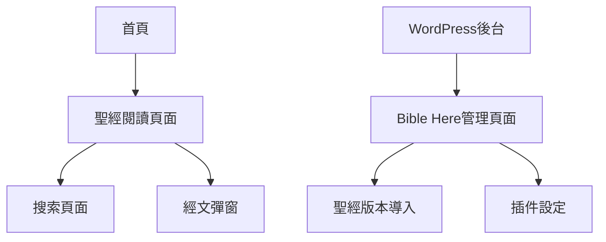

# Bible Here WordPress Plugin 產品需求文檔

## 1. Product Overview
Bible Here 是一個專為WordPress設計的基督教聖經插件，讓使用者能在手機和電腦上翻閱、檢索並比對不同語言版本的聖經、註釋、串珠和Strong Number。
- 解決基督教網站需要提供多語言聖經閱讀和研經工具的需求，讓訪客無需離開網站即可深入研讀聖經。
- 目標發佈到WordPress.org官方插件庫，服務全球基督教社群和教會網站。

## 2. Core Features

### 2.1 User Roles
| Role | Registration Method | Core Permissions |
|------|---------------------|------------------|
| 訪客用戶 | 無需註冊 | 可瀏覽聖經、搜索經文、使用比對功能 |
| WordPress管理員 | WordPress後台登入 | 可管理聖經版本、導入新聖經、配置插件設定 |

### 2.2 Feature Module
我們的聖經插件需求包含以下主要頁面：
1. **聖經閱讀頁面**：版本選擇器、書卷章節導航、經文顯示區域、註釋按鈕
2. **搜索頁面**：搜索輸入框、搜索結果列表、高亮顯示
3. **管理後台頁面**：聖經版本管理、遠程導入功能、插件設定
4. **經文彈窗組件**：自動識別經文縮寫、popover顯示、AJAX載入功能

### 2.3 Page Details
| Page Name | Module Name | Feature description |
|-----------|-------------|---------------------|
| 聖經閱讀頁面 | 版本選擇器 | 下拉選單選擇不同語言聖經版本，支持並排比對顯示 |
| 聖經閱讀頁面 | 書卷章節導航 | 書卷列表、章節選擇、上下章導航按鈕 |
| 聖經閱讀頁面 | 經文顯示區域 | 響應式佈局，電腦並排顯示，手機上下顯示，包含節數標記 |
| 聖經閱讀頁面 | 註釋功能 | 每節經文旁的註釋按鈕，點擊顯示註釋內容 |
| 搜索頁面 | 全文搜索 | 支持關鍵字搜索經文內容，顯示匹配結果和上下文 |
| 搜索頁面 | 搜索結果 | 分頁顯示搜索結果，高亮關鍵字，點擊跳轉到對應經文 |
| 管理後台頁面 | 聖經版本管理 | 列出已安裝聖經版本，顯示安裝狀態和基本信息 |
| 管理後台頁面 | 遠程導入功能 | 從Zefania XML格式遠程下載並導入新聖經版本 |
| 管理後台頁面 | 插件設定 | 啟用/停用經文自動識別功能，配置顯示選項 |
| 經文彈窗組件 | 自動識別 | 使用正則表達式自動識別頁面中的經文縮寫（如"創1:1"） |
| 經文彈窗組件 | Popover顯示 | 點擊經文縮寫顯示完整經文內容的彈窗 |
| 經文彈窗組件 | AJAX導航 | 彈窗內提供前後章節導航按鈕，無需重新載入頁面 |
| 經文彈窗組件 | Shortcode支持 | 支持手動shortcode [bible-here ref="Gen1:1"]內容[/bible-here] |

## 3. Core Process

**訪客用戶流程：**
用戶訪問網站 → 進入聖經閱讀頁面 → 選擇聖經版本和書卷章節 → 閱讀經文並可點擊註釋 → 使用搜索功能查找特定經文 → 在其他頁面自動識別經文縮寫並點擊查看

**管理員流程：**
登入WordPress後台 → 進入Bible Here設定頁面 → 查看已安裝聖經版本 → 選擇並導入新的聖經版本 → 配置經文自動識別功能 → 發佈包含經文shortcode的內容

## 4. User Interface Design

### 4.1 Design Style
- 主色調：深藍色 (#2C3E50) 和金色 (#F39C12)，體現莊重和神聖感
- 按鈕樣式：圓角按鈕，3D陰影效果，hover時有漸變動畫
- 字體：中文使用思源黑體，英文使用 Georgia 或 Times New Roman，經文內容字體大小16px
- 佈局風格：卡片式設計，頂部導航，響應式網格佈局
- 圖標風格：使用簡潔的線條圖標，配合聖經主題的十字架、書本等元素

### 4.2 Page Design Overview
| Page Name | Module Name | UI Elements |
|-----------|-------------|-------------|
| 聖經閱讀頁面 | 版本選擇器 | 下拉選單樣式，深藍色背景，白色文字，hover效果 |
| 聖經閱讀頁面 | 經文顯示區域 | 白色背景卡片，經文文字16px，節數使用金色標記，行間距1.6 |
| 搜索頁面 | 搜索框 | 圓角輸入框，搜索圖標，placeholder提示文字 |
| 管理後台頁面 | 版本列表 | 表格樣式，狀態指示燈（綠色已安裝/灰色未安裝），操作按鈕 |
| 經文彈窗組件 | Popover | 白色背景，陰影效果，圓角邊框，最大寬度400px |

### 4.3 Responsiveness
採用移動優先的響應式設計，在桌面端支持雙欄並排顯示聖經版本，移動端自動切換為單欄上下顯示。支持觸控操作優化，包括滑動翻頁和點擊放大功能。